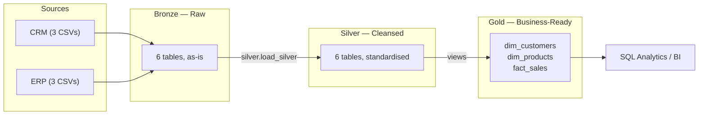

# Data Warehouse and Analytics Project

A complete data warehousing and analytics solution: raw CSV extracts from two
source systems are landed, cleansed, integrated into a star schema, and queried
for business insight. Built as a portfolio project demonstrating Medallion
architecture, ETL design, dimensional modelling and analytical SQL.

**Engine:** MySQL 8.0

---

## Data Architecture

The warehouse follows the **Medallion Architecture** — Bronze, Silver and Gold
layers, each consuming only the layer below it.



- **Bronze** — stores raw data exactly as it arrives from the source systems.
  Ingested from CSV files into MySQL. No transformation of any kind, so every
  warehouse value stays traceable to its source line.
- **Silver** — data cleansing, standardisation and normalisation, preparing the
  data for analysis.
- **Gold** — business-ready data modelled into a star schema for reporting and
  analytics.

> A note on layers: SQL Server models Medallion layers as *schemas* inside one
> database. MySQL has no schema-below-database concept, so each layer is its own
> database. Every qualified name (`bronze.crm_cust_info`, `gold.fact_sales`)
> reads identically to the SQL Server design.

Full detail, including the star-schema ER diagram, is in
[docs/data_architecture.md](docs/data_architecture.md).

---

## Project Overview

This project involves:

1. **Data Architecture** — designing a modern data warehouse using Medallion
   Architecture.
2. **ETL Pipelines** — extracting, transforming and loading data from source
   systems into the warehouse.
3. **Data Modeling** — developing fact and dimension tables optimised for
   analytical queries.
4. **Analytics & Reporting** — creating SQL-based reports for actionable
   insight.

Skills demonstrated: SQL development, data architecture, data engineering, ETL
pipeline development, data modeling, and data analytics.

---

## Repository Structure

```
Project_1/
│
├── dataset/                            # Raw datasets (ERP and CRM extracts)
│   ├── source_crm/
│   │   ├── cust_info.csv               # 18,493 customer records
│   │   ├── prd_info.csv                # 397 products
│   │   └── sales_details.csv           # 60,398 sales order lines
│   └── source_erp/
│       ├── CUST_AZ12.csv               # 18,483 customer demographics
│       ├── LOC_A101.csv                # 18,484 customer locations
│       └── PX_CAT_G1V2.csv             # 36 product categories
│
├── docs/                               # Documentation and architecture
│   ├── data_architecture.md            # Layer design, data flow, star schema
│   ├── data_catalog.md                 # Field-level catalog of the gold layer
│   ├── naming_conventions.md           # Naming rules for tables and columns
│   └── requirements.md                 # Requirements + data-quality register
│
├── scripts/                            # ETL and transformation SQL
│   ├── init_database.sql               # Creates bronze / silver / gold
│   ├── bronze/
│   │   ├── ddl_bronze.sql              # Raw landing tables
│   │   └── load_bronze.sql             # CSV -> bronze
│   ├── silver/
│   │   ├── ddl_silver.sql              # Cleansed tables
│   │   └── proc_load_silver.sql        # silver.load_silver() — the ETL
│   └── gold/
│       └── ddl_gold.sql                # Star-schema views
│
├── tests/                              # Data-quality checks
│   ├── quality_checks_silver.sql       # 14 checks
│   └── quality_checks_gold.sql         # 7 checks
│
├── analytics/                          # BI reporting queries
│   ├── 01_sales_trends.sql
│   ├── 02_product_performance.sql
│   └── 03_customer_behaviour.sql
│
├── run_pipeline.ps1                    # One-command end-to-end runner
├── README.md
├── LICENSE
├── .gitignore
└── requirements.txt                    # Optional Python exploration deps
```

---

## Getting Started

### Prerequisites

- **MySQL 8.0 or later** — window functions (`ROW_NUMBER`, `LEAD`) are required
  by the silver ETL and are not available in 5.7.
- The `mysql` command-line client (ships with MySQL Server).

### Server configuration

The bronze load reads CSVs from the repository using `LOAD DATA LOCAL INFILE`,
because the server's `secure-file-priv` restricts plain `LOAD DATA INFILE` to
its own `Uploads` directory. Enable the local-infile capability once:

```sql
SET GLOBAL local_infile = 1;
```

To make it permanent, add `local_infile=1` under `[mysqld]` in `my.ini` and
restart the service.

### Run the whole pipeline

From the repository root:

```powershell
.\run_pipeline.ps1
```

This executes all seven stages in order and finishes with the quality checks.

> **Warning:** the first stage DROPs and recreates the `bronze`, `silver` and
> `gold` databases. Anything in them is lost.

### Or run stage by stage

Every command must be run **from the repository root** — `LOAD DATA LOCAL
INFILE` resolves its paths relative to the client's working directory.

```bash
mysql -u root -p                        < scripts/init_database.sql
mysql -u root -p                        < scripts/bronze/ddl_bronze.sql
mysql -u root -p --local-infile=1       < scripts/bronze/load_bronze.sql
mysql -u root -p                        < scripts/silver/ddl_silver.sql
mysql -u root -p                        < scripts/silver/proc_load_silver.sql
mysql -u root -p -e "CALL silver.load_silver();"
mysql -u root -p                        < scripts/gold/ddl_gold.sql

# Verify — every 'violations' count must be 0
mysql -u root -p < tests/quality_checks_silver.sql
mysql -u root -p < tests/quality_checks_gold.sql

# Explore
mysql -u root -p < analytics/01_sales_trends.sql
```

---

## The ETL in brief

The interesting work is in `silver.load_silver()`. The source data is
deliberately dirty; each rule exists because of a specific defect found by
profiling the CSVs.

| Defect in source | Fix applied |
|---|---|
| `cst_id` duplicated across rows | `ROW_NUMBER()` keeps the most recent record per customer |
| Names padded with whitespace (`" Jon"`, `"Yang "`) | `TRIM()` |
| Gender / marital status held as single-letter codes | Expanded to full words; unknowns become `n/a`, never `NULL` |
| `prd_key` is a composite of two identifiers | Split into `cat_id` (chars 1–5, `-` → `_`) and the real product key (chars 7+) |
| `prd_end_dt` unreliable | Recalculated as the day before the next start date for the same product |
| Blank `prd_cost` | Defaulted to `0` so revenue maths never nulls out |
| Order dates stored as integers (`20101229`), 19 of them invalid | Converted to `DATE`; invalid values become `NULL` |
| `sales <> quantity * price`; negative prices | Recomputed from the identity using `ABS(price)` |
| Customer key differs in all three sources (`AW00011000` / `NASAW00011000` / `AW-00011000`) | `NAS` prefix and hyphens stripped so all conform to the CRM key |
| Country codes inconsistent (`DE`, `US`, `USA`, blank) | Normalised to full names; blanks become `n/a` |

The full register, with the reasoning behind each decision, is in
[docs/requirements.md](docs/requirements.md).

---

## Analytics

Three report scripts cover the BI objective:

- **[Sales Trends](analytics/01_sales_trends.sql)** — headline KPIs, monthly
  running totals and 3-month moving average, year-over-year change, and revenue
  by country.
- **[Product Performance](analytics/02_product_performance.sql)** — category
  revenue share, top and bottom 10 products, each product benchmarked against
  its own category average, and cost banding.
- **[Customer Behaviour](analytics/03_customer_behaviour.sql)** — demographic
  spread, age banding, VIP/Regular/New segmentation, and top 20 customers by
  lifetime value.

---

## License

Released under the [MIT License](LICENSE). Free to use, modify and share with
attribution.
