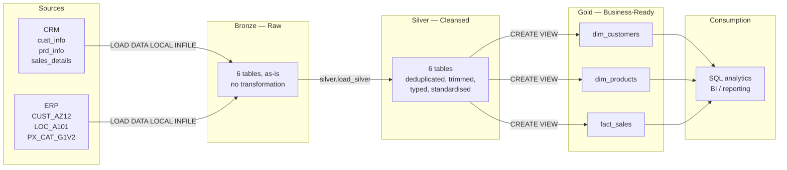
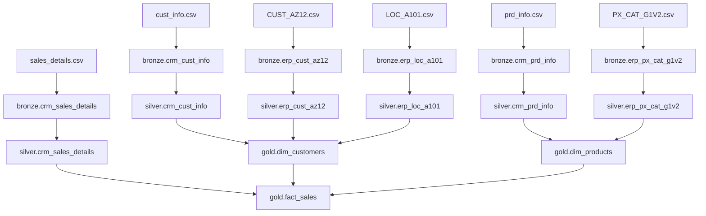
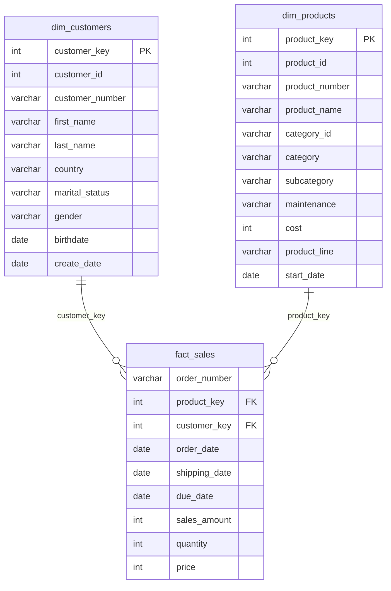

# Data Architecture

The warehouse follows the **Medallion Architecture**: three layers, each with a
single responsibility, each consuming only the layer below it.

## Layer responsibilities

| | Bronze | Silver | Gold |
|---|---|---|---|
| **Purpose** | Faithful landing zone | Cleansing and conforming | Business consumption |
| **Object type** | Tables | Tables | Views |
| **Transformation** | None | Dedup, trim, type-cast, standardise, derive, repair | Joins, renames, surrogate keys |
| **Data model** | As-is from source | As-is from source | Star schema |
| **Load** | Full refresh, truncate + insert | Full refresh, truncate + insert | Recomputed on query |
| **Audience** | Data engineers | Data engineers, analysts | Analysts, business users |

### Why bronze transforms nothing

Bronze exists so that any warehouse value can be traced back to the exact CSV
line it came from. The moment bronze cleans something, that audit trail is
gone and a bug in the cleansing rule becomes unprovable. This is why the CRM
sales dates stay as meaningless integers (`20101229`) in bronze — the invalid
values must survive long enough for silver to report on them.

### Why gold is views rather than tables

Gold adds no new data: it renames, joins and assigns surrogate keys. Making it
physical would duplicate storage and add a second refresh step that could fall
out of sync with silver. Views recompute on read and are always consistent
with the layer beneath them.

The trade-off is query cost — `fact_sales` joins two dimension views on every
read. At this data volume (~60k fact rows) that is immaterial. At a volume
where it mattered, the fix would be to materialise gold into tables loaded by
a `load_gold` procedure, keeping the same names so nothing downstream changes.

## Data flow

## Star schema

`fact_sales` sits at the centre, with two conformed dimensions.

## Key integration decisions

**Customer keys differ across all three sources.** CRM uses `AW00011000`, ERP
customer uses `NASAW00011000`, ERP location uses `AW-00011000`. Silver strips
the `NAS` prefix and the hyphens so all three conform to the CRM key, which is
the master.

**Gender is mastered by CRM.** Both systems carry it and they disagree. The
gold layer takes the CRM value and falls back to ERP only where CRM has none,
rather than preferring ERP or trying to reconcile the two.

**Product category is derived, not supplied.** The link between CRM products
and ERP categories is not an explicit foreign key — it is embedded in the first
five characters of `prd_key`. Silver extracts it into `cat_id` and converts the
separator so it matches `erp_px_cat_g1v2.id`.
